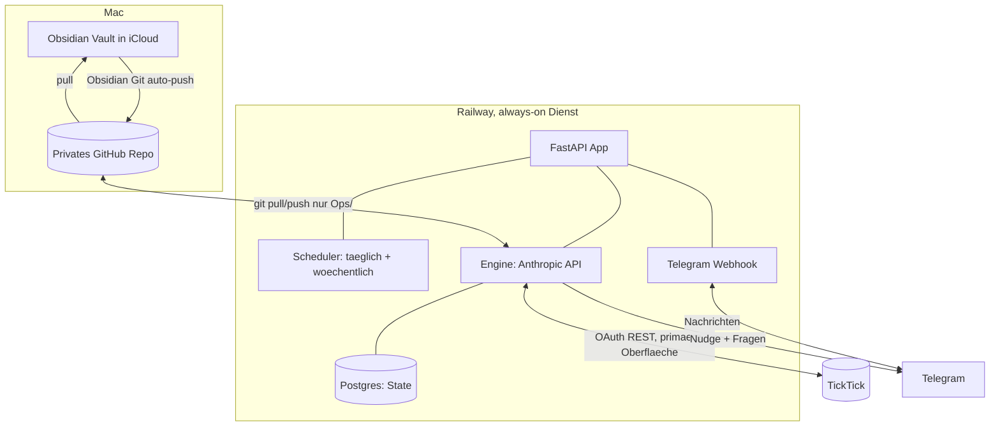

# Ops-Agent, Build-Spec

> Vollständige, baubare Spezifikation für das persönliche Ops-/Sparring-System. Geschrieben so, dass du (oder Claude mit dir) jederzeit von hier aus bauen kannst, ohne den Kontext neu herzuleiten. Status: spezifiziert, noch nicht gebaut.
>
> **Update:** TickTick-API-Frage geklärt. Offizielle Open-API kann Tags schreiben. TickTick wird die primäre Oberfläche, der Vault tritt zurück. Siehe markierte Abschnitte.

---

## Zweck (kurz)

Ein System, das zwei Dinge dauerhaft löst:
1. **Mechanik:** Jeder Task ist eine konkrete nächste Aktion, energie-getaggt (Deep/Admin/Call), mit Zustand: actionable / waiting-on-jemand (Owner + Nachfass-Datum) / bewusst geparkt (Grund). **Alles direkt in TickTick sichtbar und abhakbar.**
2. **Urteil (der eigentliche Wert):** Disconnects aufdecken. Wo sagt die Strategie im Vault das eine und TickTick tut das andere. Wo ist „dringend" in Wahrheit geparkt. Wo wird zur bequemen Solo-Arbeit gegriffen, während People-Tasks auf dem kritischen Pfad liegen bleiben.

Zwei harte Anforderungen: es muss **zu mir kommen** (Push via Telegram, kein Chat zum Öffnen) und darf **nie Kontext verlieren** (Ground Truth bei jedem Lauf frisch lesen). Plus: **ich will alles in TickTick haben und dort abhaken, nicht im Vault nachschauen müssen.**

---

## Primäre Oberfläche: TickTick (Design-Entscheidung)

TickTick ist mein Arbeitsplatz. Der Agent hält dort dauerhaft aktuell:
- **Energie-Tags:** `#deep`, `#admin`, `#call`.
- **Status-Tags:** `#waiting`, `#parked`.
- **Fälligkeit + Priorität** (TickTick-Priority: 0 keine, 1 niedrig, 3 mittel, 5 hoch).
- **Das „Warum" im content-Feld des Tasks:** bei `#waiting` der Owner + Nachfass-Datum, bei `#parked` der Grund + Review-Datum. So sehe ich es in TickTick, nicht nur im Vault.

**Das Menü ist eine native TickTick-Ansicht, kein Vault-Artefakt.** Ich lege einmalig drei gespeicherte Filter/Smart-Lists an: Deep, Admin, Call. Müde = Filter Admin antippen, Item ziehen. Ein vierter Filter blendet `#waiting` und `#parked` aus den aktiven Ansichten aus, damit „heute machbar" sauber bleibt.

Der Vault tritt zurück: er hält Strategie (Projekt-Notes) und das wöchentliche Review-Protokoll. Er ist nicht mehr mein täglicher Arbeitsort.

---

## Architektur (final)



**Komponenten:**
- **Railway-Dienst (always-on):** FastAPI mit (a) Scheduler, (b) Telegram-Webhook für Sofortverarbeitung, (c) Engine, (d) Postgres.
- **Engine:** Python ruft die Anthropic-API auf (`claude-sonnet-4-6` für Routine, stärkeres Modell für den Wochen-Tiefpass). Liest bei jedem Lauf TickTick und Vault frisch. KEIN interaktives Claude Code im Betrieb (nur lokal zum Bauen).
- **TickTick:** **primäre Oberfläche**, über eigenes OAuth-Token. API geklärt, siehe unten.
- **Vault-Bridge:** privates GitHub-Repo, befüllt vom Obsidian-Git-Plugin auf dem Mac. Agent liest per `git pull`, schreibt nur nach `Ops/` per `git pull --rebase` + push + Retry.
- **Telegram:** Bot via BotFather. Nudges + Fragen raus, Antworten rein via Webhook.
- **Postgres:** Arbeitsgedächtnis (offene Fragen, Waiting/Parked mit Datumslogik zum Wiedervorlegen, Änderungs-Cache, Run-Log).

---

## TickTick-API (geklärt)

Basis `https://api.ticktick.com/open/v1`, OAuth2, Scopes `tasks:read` + `tasks:write`, Redirect-URI beim App-Anlegen setzen (z.B. `http://127.0.0.1:8765/callback` für den lokalen Auth-Flow).

**Kann (bestätigt):** Projekte listen; Tasks eines Projekts lesen (`GET /open/v1/project/{projectId}/data`); Task anlegen, updaten, abschließen, löschen. Task-Schema: title, content, projectId, dueDate (ISO), priority (0/1/3/5), **tags (Array, schreibbar)**, reminders, items/subtasks.

**Kann nicht (alles handhabbar):**
- Kein globaler „alle Tasks"-Endpoint. Agent iteriert über alle Projekte und aggregiert.
- Keine serverseitigen Komplexfilter. Filterung passiert im Agenten.
- Keine nativen Webhooks. Irrelevant, der Agent pollt nach Zeitplan.
- Keine Habits über die offizielle API.

**Implementierungs-Gotcha:** Ein Task-Update ersetzt vermutlich die ganze tags-Liste, statt zu mergen. Der Agent muss die bestehenden manuellen Tags des Tasks immer mitlesen und nur den Energie-/Status-Tag darin austauschen, sonst werden manuelle Tags überschrieben. **Beim Bauen verifizieren** (Update merge vs. replace), ebenso die Response-Shapes und ob Tag-Namen lowercased werden.

**Fallback, nur falls Iteration/Rate-Limits beißen:** inoffizielle Library (ticktick-py / dida365) nutzt die reichere private API, birgt aber Stabilitäts- und Passwort-Risiko. Nach jetzigem Stand nicht nötig.

---

## Datenfluss

**Sofort (Webhook):** Telegram schickt meine Antwort an den Dienst. Engine interpretiert sofort (Anthropic-Call mit DB-Kontext), aktualisiert DB und, nach meiner Bestätigung, TickTick (Tags, content, Fälligkeit). Bestätigt mir im Chat. Keine Wartezeit.

**Täglich kurz (morgens, Europe/Vienna):** git pull. Alle Projekte aus TickTick lesen und aggregieren. Änderungen seit letztem Poll erkennen (Abhaken, neue Tasks, Edits) und DB-Cache aktualisieren. Schneller Disconnect-Scan. **Energie-/Status-Tags in TickTick aktuell halten** (sichere Fälle auto, bedeutungsändernde als Vorschlag). Fällige `#waiting`/`#parked`-Items wiedervorlegen (Tag entfernen oder Telegram-Nudge). Kurze Telegram-Nachricht: knappe Lage („3 deep, 4 admin, 1 call heute") + 0-3 Fragen. **Das Menü selbst lese ich in TickTick**, nicht in der Nachricht.

**Wöchentlich tief (Sonntag):** Voller Pass. Alle aktiven Projekt-Notes mit Status-Frontmatter lesen, projektweise gegen TickTick abgleichen (Strategie-vs-Task-Reconciliation). Waiting-For mit fälligen Nachfass-Daten. Geparkte Items auf Gültigkeit prüfen. Vage Tasks in konkrete nächste Aktionen umformulieren (Vorschlag) und neu taggen. Review-Protokoll nach `Ops/Weekly/` schreiben. `Ops/state.md` spiegeln. Die 3-5 wichtigsten Entscheidungen per Telegram, Änderungen erst nach Bestätigung.

---

## Was der Agent in `Ops/` schreibt (Rolle verkleinert)

Seit TickTick die primäre Oberfläche ist, ist `Ops/` **nur noch** Strategie-Log, nicht mein täglicher Arbeitsort.

Ownership-Regel: **Agent schreibt alles in `Ops/` außer `config.md`. Ich editiere nur `config.md`.** Disjunkte Schreibmengen, daher praktisch keine Merge-Konflikte.

```
Ops/
  README.md            (Agent-owned. Erklaert den Ordner)
  config.md            (HUMAN-owned, Agent read-only. Mapping Vault<->TickTick-Projekte, Tag-Konventionen, Laufzeiten, Praeferenzen)
  state.md             (Agent-owned. Menschenlesbarer Spiegel: Waiting-For, Parked, offene Fragen, Disconnect-Historie)
  Weekly/
    2026-W26.md        (Agent-owned. Wochen-Review-Narrativ + Strategie-Abgleich)
```

Kein `Daily/`-Menü mehr nötig, das Tagesmenü lebt als TickTick-Ansicht. Optional kann der Agent eine knappe Tageszusammenfassung nach `Ops/Daily/` schreiben, aber das ist Beiwerk, kein Arbeitsort.

---

## State-Datenmodell

**Primär in TickTick (was ich sehe und abhake):**
- Energie-Tags `#deep`/`#admin`/`#call`, Status-Tags `#waiting`/`#parked`.
- Fälligkeit + Priorität.
- content-Feld: Owner + Nachfass-Datum (bei waiting), Grund + Review-Datum (bei parked).

**Postgres (Arbeitsgedächtnis des Agenten, sehe ich nicht direkt):**
- `tasks_cache`: ticktick_id, project_id, title, tags, due, priority, status, last_hash, updated_at. (Änderungserkennung.)
- `waiting_for`: id, ticktick_id, item, owner, since, chase_date, status. (Datumslogik zum Wiedervorlegen.)
- `parked`: id, ticktick_id, item, reason, since, review_date.
- `questions`: id, text, options(json), status, created_at, answered_at, answer.
- `runs_log`: id, type(daily/weekly/webhook), status, error, ts.

`Ops/state.md` ist nur ein menschenlesbarer Spiegel der DB. Git ist kein transaktionaler Speicher, nie als State-DB missbrauchen.

---

## Disconnect-Erkennung (die Logik hinter Job 2)

Mapping: `Ops/config.md` ordnet Vault-Projektordner (`03-Projects/*`) den TickTick-Projekten zu (Default: gleicher Name). Der Agent liest `status`/`type`-Frontmatter der Projekt-Notes und vergleicht mit der Task-Aktivität.

Geflaggt wird u.a.:
- Vault `status: frozen`, aber aktive Tasks im selben Projekt (Klara M1 vs „frozen").
- `#waiting`/`#parked`-Task, dessen chase_date/review_date erreicht ist.
- Vage Tasks ohne konkrete nächste Aktion.
- Überfälliger High-Prio-Task, der real auf eine ungenannte Vorbedingung wartet (Hebammengremium-Fall).
- Verhaltensmuster: viele bequeme Solo-Tasks bewegt, People-/Critical-Path-Tasks unbewegt.

---

## Propose-then-Confirm (Sicherheit + Vertrauen)

Der Agent ändert **nie eigenmächtig** Prioritäten, Titel oder Zustände. Er schlägt vor, ich bestätige per Telegram-Tap, dann schreibt er.

- **Auto erlaubt:** Energie-Tags anwenden NACHDEM ich die Konvention einmal freigegeben habe; überfällige Items surfacen; fällige Waiting-/Parked-Items wiedervorlegen; optionale Tageszusammenfassung.
- **Nachfragen:** alles, was Intent/Priorität/Zustand ändert: Strategie-vs-Task-Mismatch, Unparken, vorgeschlagene nächste Aktion, Titeländerung, Priorität.

---

## Sicherheit

- Telegram-Webhook ist öffentlich: nur Updates von **meiner** chat_id akzeptieren, `secret_token`-Header prüfen, Rest verwerfen.
- Alle Secrets (Bot-Token, TickTick-Tokens, Anthropic-Key, GitHub-Token, DB-URL) nur in Railway-Env, nie im Repo.
- Wochenpass schickt nur **relevante** Projekt-Notes an die API, nicht den ganzen Vault (Finanzen, People, Bitschnau-Medizinkontext bleiben draußen, außer nötig). Spart Tokens, minimiert Exposure.
- OAuth-Token-Refresh implementieren (TickTick-Token läuft ab).
- Tag-Update: bestehende manuelle Tags mitlesen und erhalten (siehe Gotcha).
- Bei Lauf-Fehler: kurze Telegram-Fehlermeldung statt stillem Sterben, in `runs_log`.

---

## Engine-Protokolle (der „Brain", direkt nutzbar)

### Täglich kurz
```
Du bist mein Ops-Agent. Lauf: taeglich kurz. TickTick ist meine primaere Oberflaeche.
1. Lies alle TickTick-Projekte, aggregiere Tasks. Erkenne Aenderungen seit letztem Poll (DB-Cache).
2. Lies DB-State: offene Fragen, Waiting mit chase_date<=heute, Parked mit review_date<=heute.
3. Schneller Disconnect-Scan. Max 3 Befunde, nur echter Hebel.
4. Halte Energie-/Status-Tags in TickTick aktuell. Sichere Faelle auto, bedeutungsaendernde als Vorschlag. Bestehende manuelle Tags immer erhalten.
5. Lege faellige Waiting-/Parked-Items wieder vor (Tag entfernen oder nudgen).
6. Telegram: knappe Lage (Zaehlung pro Bucket) + 0-3 Fragen mit Optionen. Das Menue lese ich in TickTick.
Ton: blunt, konkret. Wenn nichts Dringendes: knapp, draeng nicht auf Arbeit.
```

### Wöchentlich tief (Sonntag)
```
Du bist mein Ops-Agent. Lauf: woechentlich tief.
1. git pull. Lies aktive Projekt-Notes (03-Projects/*, Frontmatter) laut Ops/config.md Mapping.
2. Lies alle offenen TickTick-Tasks projektweise.
3. Reconciliation pro Projekt: passt Task-Aktivitaet zum erklaerten Status/Prioritaet? Liste Disconnects.
4. Waiting-For: was ist faellig zum Nachfassen, was ist still wieder mein Problem geworden?
5. Parked: Grund noch gueltig oder unparken?
6. Jeden vagen Task in konkrete naechste Aktion umformulieren (Vorschlag), energie-taggen. content-Feld mit Owner/Datum bzw. Grund/Datum pflegen.
7. Wochen-Narrativ nach Ops/Weekly/<jahr-woche>.md. Ops/state.md spiegeln.
8. Telegram: wichtigste 3-5 Entscheidungen als Fragen mit Optionen. Aenderungen erst nach Bestaetigung schreiben.
Erinnerung: mein groesstes Risiko ist Drift, nicht zu wenig Arbeit. Flagge Komfort-Arbeit, die hoehere Hebel verdraengt. Rest ist legitim.
```

---

## Offene Entscheidungen

### 1. TickTick-API: GEKLÄRT. Offizielle Open-API kann Tags schreiben, Pfad (a) ist tragfähig. TickTick bleibt, als primäre Oberfläche. (Fallback inoffizielle Library nur falls nötig.)

### 2. Lauf-Ort: entschieden = Cloud (Railway), always-on Webservice + Webhook.

### 3. Bootstrap: Erster Wochenpass ist ein einmaliger Onboarding-Lauf, der die gesamte Bestands-Struktur vorschlägt (Tags, nächste Aktionen, Waiting/Parked + content-Felder). Nicht von sauberen Daten ausgehen.

### 4. Name des Systems offen (Vault-Root heißt schon „Jarvis").

---

## Build-Reihenfolge (inkrementell)

1. **Repo-Gerüst + Protokolle** (lokal, keine Tokens). FastAPI-Skeleton, Ordner, Protokoll-Files, config-Schema.
2. **TickTick-Anbindung:** OAuth, Projekte+Tasks lesen, Tag-Update-Verhalten (merge vs replace) verifizieren.
3. **Engine-Kern:** manueller Tagespass lokal lauffähig (liest TickTick, taggt, schreibt content).
4. **TickTick-Ansichten:** drei Filter (Deep/Admin/Call) + Ausblend-Filter für waiting/parked anlegen.
5. **Vault-Bridge:** GitHub-Repo, Obsidian-Git, pull/rebase/push in `Ops/`.
6. **Telegram:** Bot, Push raus, Webhook rein, chat_id-Whitelist.
7. **Postgres-State** + Propose-then-Confirm-Loop.
8. **Scheduler** (täglich + Sonntag, Europe/Vienna) auf Railway.
9. **Bootstrap-Lauf** einmalig.
10. Härten: Fehler-Telegram, Token-Refresh, Push-Race-Retry.

---

## Setup-Checkliste (einmalige manuelle Dinge)

1. Telegram-Bot via BotFather. Token + meine chat_id notieren. Token NIE öffentlich.
2. Privates GitHub-Repo für den Vault. Obsidian-Git-Plugin verbinden, Auto-Push (z.B. alle 10 Min).
3. TickTick-OAuth-App unter developer.ticktick.com (Manage Apps). Scopes tasks:read + tasks:write, Redirect-URI setzen. Token holen.
4. In TickTick drei gespeicherte Filter anlegen: Deep, Admin, Call. Plus ein Filter, der `#waiting`/`#parked` aus aktiven Ansichten ausblendet.
5. Railway-Projekt + Postgres-Plugin.
6. Secrets in Railway-Env: TELEGRAM_BOT_TOKEN, TELEGRAM_CHAT_ID, TELEGRAM_SECRET, TICKTICK_CLIENT_ID/SECRET/TOKEN, ANTHROPIC_API_KEY, GITHUB_TOKEN, DATABASE_URL.

---

## Kosten (realistisch, monatlich)

- Railway always-on + kleine Postgres: ca. 5 bis 10 Euro.
- Anthropic-API: täglich billig, Wochen-Tiefpass größer. Mit gescoptem Vault-Read grob 5 bis 15 Euro.
- Telegram, GitHub privat: gratis.
- **Summe: grob 10 bis 25 Euro/Monat.**

---

## Bekannte Caveats

- iCloud + `.git` auf einem Mac: unproblematisch bei genau einem Mac. Bonus: volle Vault-Versionshistorie.
- Git-Latenz: Agent sieht Vault-Stand vom letzten Push (paar Minuten alt). Für täglich/wöchentlich egal.
- Push-Race Mac vs Railway: durch `pull --rebase` + Retry und disjunkte Schreibmengen entschärft.
- TickTick: keine veröffentlichten Rate-Limits, also höflich pollen (einmal täglich/wöchentlich plus Webhook ist unkritisch).

---

## Related
- [[03-Projects/Career/Career]]
- [[03-Projects/Klara/Klara]]
- [[06-Uni/Anreise-Grenoble]]
